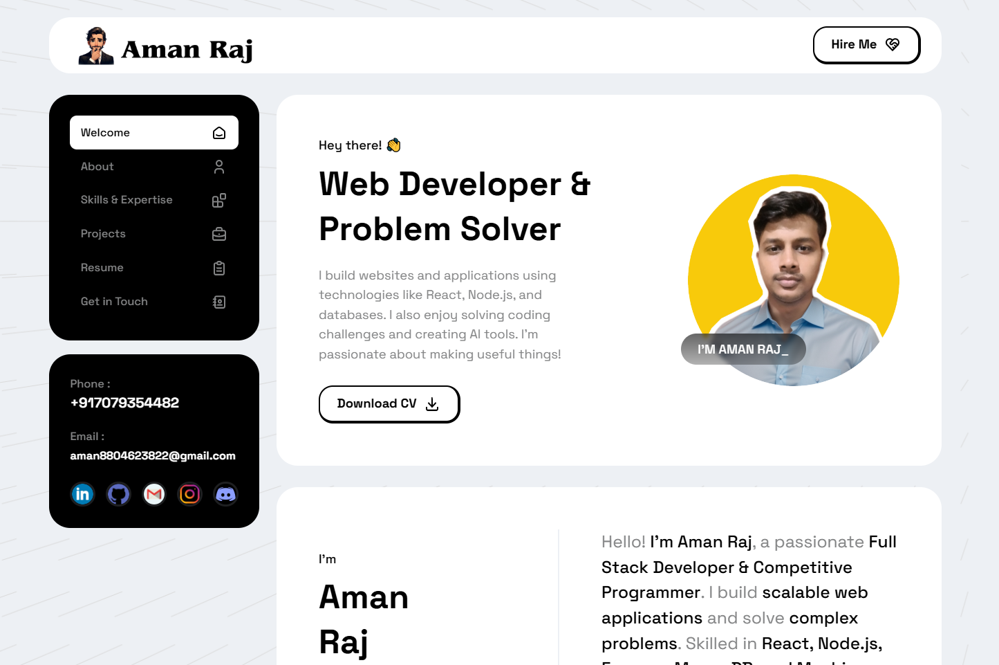

# 🚀 My Awesome Portfolio Website



👋 Hey there! This repository contains the source code for my personal portfolio website. It's designed to showcase my skills, projects, and passion for web development and problem-solving.

## ✨ What You'll Find Here

This portfolio is more than just a collection of my work; it's a digital representation of my journey as a developer. Here's a sneak peek of what you'll find:

*   **About Me:** Learn about my background, skills, and areas of expertise.
*   **Projects:** Explore a showcase of my diverse projects, ranging from full-stack web applications to machine learning tools. Each project comes with a description, code snippets, demo links, and more!
*   **Skills:** See a detailed view of my technical skills, including languages, frameworks, and tools I'm proficient in.
*   **Awards:** Check out my achievements, hackathon wins, and ratings on different platforms.
*   **Contact:** Find all the ways you can connect with me.
*   **Responsive Design:** Enjoy a seamless experience on all screen sizes.

## 🛠️ Built With

This portfolio is crafted using a variety of cutting-edge technologies:

*   **Frontend:** HTML, CSS, JavaScript, React.js, Bootstrap
*   **Database (if applicable):** MongoDB
*   **Styling:** CSS Modules, Bootstrap
*   **Other Libraries/Tools:** Git, Axios, NumPy, Pandas

## 🚀 Live Demo 🖥️

Check out the live version of my portfolio website:
➥ [Live Demo](https://amancore.github.io/Portfolio/)

## 📁 How to Run Locally

Want to explore the code on your own machine? Follow these easy steps:

1.  **Clone the Repository:**

    ```bash
    git clone https://github.com/amancore/Portfolio
    ```

2.  **Navigate to the Project Directory:**

    ```bash
    cd Portfolio
    ```

3.  **Open `index.html` in Your Browser:**
    *   Locate the `index.html` file in your project directory.
    *   Open this file directly with your web browser (e.g., Chrome, Firefox, Safari) by double-clicking it or right clicking and opening with a browser.

That's it! You can now explore the static HTML website.

## 🤝 Contributing

I'm open to feedback and contributions to improve this portfolio. If you have any ideas, suggestions, or found any issues, please feel free to:

*   **Fork the repository and submit a pull request with your changes.**
*   **Open an issue to discuss any problems or features you'd like to see implemented.**

## 📞 Let's Connect
I'm always looking to collaborate on exciting new projects. Connect with me through my socials:

*   [LinkedIn](https://www.linkedin.com/in/amancore/)
*   [GitHub](https://github.com/amancore)
*   [Email](mailto:aman8804623822@gmail.com)
*   [Instagram](https://www.instagram.com/chourasia_aman_/)

---

Made with ❤️ by Aman Raj
